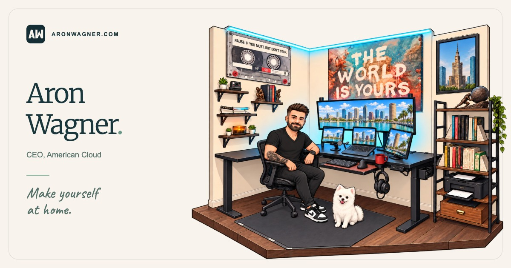

# aronwagner.com

The personal website of Aron Wagner, CEO of [American Cloud](https://americancloud.com/). It is an
illustrated, clickable version of his home office, with Rebecca, Jack and Maggie the Goldendoodle,
and it's self-hosted on an American Cloud virtual machine.

**[Visit the site →](https://aronwagner.com/)**

[](https://aronwagner.com/)

Built with plain HTML, CSS and JavaScript: no framework and no runtime npm dependencies. A small
build script produces fingerprinted, long-cached assets, and [Caddy](https://caddyserver.com/)
serves them from American Cloud behind Cloudflare's DNS and CDN.

## What's on the page

The office illustration has day and night versions that follow the time of day in
`America/New_York` (night from 7 p.m. to 6 a.m.), with a manual toggle. Clicking around the room:

| Object         | What it does                                           |
| -------------- | ------------------------------------------------------ |
| Aron           | Opens his business card                                |
| Left monitor   | An X feed; opens Aron's X profile after a confirmation |
| Right monitor  | An American Cloud dashboard; opens americancloud.com   |
| Framed uniform | His Army service                                       |
| Bible          | John 3:16 (King James Version)                         |
| Golf bag       | An invitation to play a round, with an email link      |
| Camera         | Photos from the camera roll, in a Polaroid frame       |
| Rebecca        | Their wedding-day photo                                |
| Maggie         | Pet her                                                |
| Toy bin        | Play fetch: a squeak toy flies to Maggie               |

On touch devices, small pulsing pins mark the objects. Every dialog supports Escape, its close
button and backdrop clicks, and returns focus to the object that opened it.

Three browser games (Surf Riders, Bay Racer and CiCi's Treat Trail) are still in the repository and
are being reworked for v2. Their pages build and have tests, but the homepage doesn't link them yet;
the game cards, the eMac link and the intro's game link are commented out in `index.html`.

## Local development

Use Node.js 24 or newer:

```sh
npm ci
npm run dev
```

Visit http://localhost:8000 (`npm run dev -- --port 8080` for another port). The development server
inlines the homepage's critical theme files, as the production build does.

- `index.html`, `styles.css` and `script.js` are the homepage. Each feature initializes
  independently, so one failing feature doesn't stop the others.
- `assets/homepage/theme-bootstrap.js` and `theme-critical.css` pick the theme before first paint.
  `theme-critical.css` is the single source of the color palette.
- `assets/office/` holds the illustration. See [its README](assets/office/README.md) for how it was
  made, how to rebuild it (`python3 tools/prepare-office-art.py`) and how the clickable objects are
  positioned.
- `assets/polaroids/` holds the camera roll. Photos are exported at 1600 px on the long edge in
  sRGB, with all metadata (including location) removed. Add a photo there and to the `photos` list
  in `script.js`, then update `PHOTO_COUNT` in the homepage tests.
- `tests/helpers/identity.cjs` holds the owner details the tests expect: name, title, email and
  social links.
- `assets/shared/`, `assets/surf-rides/`, `assets/bay-racer/` and `assets/cici-treat-trail/` are the
  games, which share a pinned copy of Three.js in `assets/vendor/three/`.

## Checks

```sh
npm run check                     # formatting, lint, unit and build tests
npm run test:browser              # browser suites against the source site
npm run test:browser:production   # builds dist/ and runs the browser suites against it
npm run format                    # apply formatting
npm run render:branding           # regenerate favicons and social sharing cards
npm run render:previews           # regenerate the game thumbnails
```

Browser suites use Puppeteer. If its Chrome wasn't downloaded, run `npm run setup:browser`, or point
`CHROME_BIN` at an installed Chrome:

```sh
CHROME_BIN='/Applications/Google Chrome.app/Contents/MacOS/Google Chrome' npm run test:browser
```

`tools/test-browser.js` accepts suite filenames to run a subset, `--root dist` to serve a build,
`--url` to test a server that's already running, and `--shard k/n` to run one of n groups balanced
by duration (`--list` previews the selection). Artifacts go to `test-results/`. Game debug hooks are
available only with `?debug=1`.

The suites cover dialogs and focus, the scene's objects at 21 phone, tablet and laptop sizes, touch
pins, first-paint theming, the photo viewer, the cards' exact wording, external-link confirmation,
and the games. They run in Chromium; check Safari and physical devices separately.

GitHub Actions runs on pull requests and pushes to `main`. A `static` job runs formatting, lint,
unit tests, the build and `deploy/smoke.sh` against `deploy/Caddyfile`. Five parallel `browser`
shards run every suite against the production build served by that same Caddyfile, with WebGL
rendered in software (`BROWSER_SOFTWARE_RENDERING=1`). Pushes to `main` deploy once both pass.

## Hosting and deployment

The site is served by [Caddy](https://caddyserver.com/) on an American Cloud VM
(`aronwagner-web`, Ubuntu 26.04, us-central-0). Cloudflare provides DNS and the CDN in front of
it: both `aronwagner.com` and `www` are proxied records, SSL/TLS mode is **Full (strict)**, and the
VM presents a Cloudflare Origin Certificate. The VM firewall only accepts HTTPS from
[Cloudflare's IP ranges](https://www.cloudflare.com/ips/), so the origin cannot be reached directly.

Pushes to `main` deploy automatically after every check passes: the `deploy` job in
`.github/workflows/check.yml` builds `dist/`, publishes it with `deploy/deploy.sh`, and runs
`deploy/smoke.sh` against the live site. It uses the `production` environment's secrets:

| Secret               | Value                                                                |
| -------------------- | -------------------------------------------------------------------- |
| `DEPLOY_HOST`        | The VM's public IP address                                           |
| `DEPLOY_SSH_KEY`     | Private key for the VM's `deploy` user                               |
| `DEPLOY_KNOWN_HOSTS` | The VM's SSH host key line (`ssh-keyscan -t ed25519 <ip>`, verified) |

To deploy manually, build and publish with the deploy key:

```sh
DEPLOY_HOST=<vm-ip> DEPLOY_SSH_KEY_FILE=~/.ssh/aronwagner_deploy_ed25519 npm run deploy
```

Each deploy uploads a timestamped release to `/srv/aronwagner.com/releases/`, switches the
`current` link to it, and reloads Caddy. If Caddy rejects the release's rules, the previous release
is restored. The five newest releases are kept. Fingerprinted files go to a shared
`/srv/aronwagner.com/immutable/` directory that deploys never prune, so pages that are already
open keep loading their assets after a release.

`deploy/Caddyfile` is the server configuration and `deploy/provision.sh` prepares a fresh VM. It
installs Caddy, creates the `deploy` user (which may only reload Caddy), disables SSH passwords,
configures the firewall, and installs the Caddyfile and a weekly Cloudflare IP refresh. It is safe to
re-run, for example after changing the Caddyfile:

```sh
scp deploy/Caddyfile deploy/refresh-cloudflare-ips.sh cloud@<vm-ip>:/tmp/
ssh cloud@<vm-ip> sudo bash -s -- "'$(cat ~/.ssh/aronwagner_deploy_ed25519.pub)'" < deploy/provision.sh
```

Install the origin certificate and key as `/etc/caddy/certs/aronwagner.com.pem` and `.key` (group
`caddy`, mode 640), then run `sudo systemctl reload caddy`. Until then, provisioning leaves a
self-signed stand-in, which Full (strict) rejects.

### Build output and response policies

`npm run build:site` selects runtime files, assembles the theme fragments, and prepares ignored
`dist/`; source notes, historical art, tests, development tools, and documentation are excluded.
Build output reports the current file count and size; `dist/asset-manifest.json` maps source asset
paths to their production URLs. `robots.txt`, `sitemap.xml` and the pages keep fixed root URLs.
`404.html` is served for missing pages, by Caddy and by the local server alike.

Production assets use content-derived URLs under `/immutable/` with a one-year immutable cache
policy. The build rewrites references consistently, so routine asset changes do not require
hand-edited query version tokens. Small application scripts/styles share a version derived from
their graph and referenced assets; large images, fonts, and the vendored library retain
independent versions across unrelated code changes. Stable asset aliases use temporary redirects
to their current immutable versions.

The build hashes inline scripts for its Content Security Policy instead of allowing arbitrary
inline JavaScript. The policy permits local assets and Cloudflare Web Analytics, prevents framing,
and disables object embeds and form submissions. Inline styles remain allowed for the illustrated
scene and dynamic game UI. Referrer, MIME-sniffing, and browser-permission headers are also emitted.

The build writes these headers and redirects from one rule list in two forms: `dist/site.caddy`,
which the VM's Caddyfile imports for each release, and `dist/_headers`/`dist/_redirects`, which the
local server in `tools/serve.js` uses for `npm run test:browser:production`. A unit test checks the
two agree. CI also serves the build through `deploy/Caddyfile` itself (`deploy/serve-local.sh`
does the same locally when Caddy is installed) and runs `deploy/smoke.sh` and every browser suite
against it. Test the packaged site when changing loading behavior, headers, asset references, or
redirects.

### Operations

- **Monitoring:** `.github/workflows/monitor.yml` runs `deploy/smoke.sh` against the live site
  every 15 minutes (retrying once) and can be run by hand from the Actions tab. GitHub emails a
  failed run to whoever last changed its schedule, and pauses scheduled workflows after 60 days
  without repository activity.
- **Cloudflare IP ranges:** the `refresh-cloudflare-ips.timer` on the VM runs
  `deploy/refresh-cloudflare-ips.sh` weekly. It updates the HTTPS allowlist by difference, so the
  firewall is never reset, and Caddy's trusted proxies. If Cloudflare's lists can't be fetched, it
  changes nothing. Run `sudo refresh-cloudflare-ips` to refresh immediately.
- **Updates:** Ubuntu's unattended upgrades apply security updates. Caddy comes from its official
  apt repository and updates with the system.

### Rebuilding the server

The VM holds nothing that isn't in this repository, except the Cloudflare Origin Certificate. A
root-disk snapshot in American Cloud is a quick restore point. To rebuild from scratch:

1. Create an Ubuntu VM with inbound TCP 22 and 443, and your SSH key for the `cloud` user.
2. Run `deploy/provision.sh` as above.
3. Install the origin certificate (reuse it, or create a new one under SSL/TLS → Origin Server in
   Cloudflare).
4. Point the proxied `aronwagner.com` A record at the new IP, and update the `DEPLOY_HOST` and
   `DEPLOY_KNOWN_HOSTS` secrets of the GitHub `production` environment.
5. Re-run the latest deploy from the Actions tab, or deploy by hand as above.

## Credits

This site began as a fork of [Mark Hammonds's](https://markhammonds.com/) personal website, and its
structure, build, tests and games are his work. Thank you, Mark. The office illustration, content,
photos and hosting are Aron's.

Fonts are self-hosted from [Merriweather](https://github.com/EbenSorkin/Merriweather4) and
[Caveat](https://github.com/googlefonts/caveat) under the SIL Open Font License (see
`assets/fonts/`). The games use [Three.js](https://threejs.org/) (MIT, `assets/vendor/three/`).
