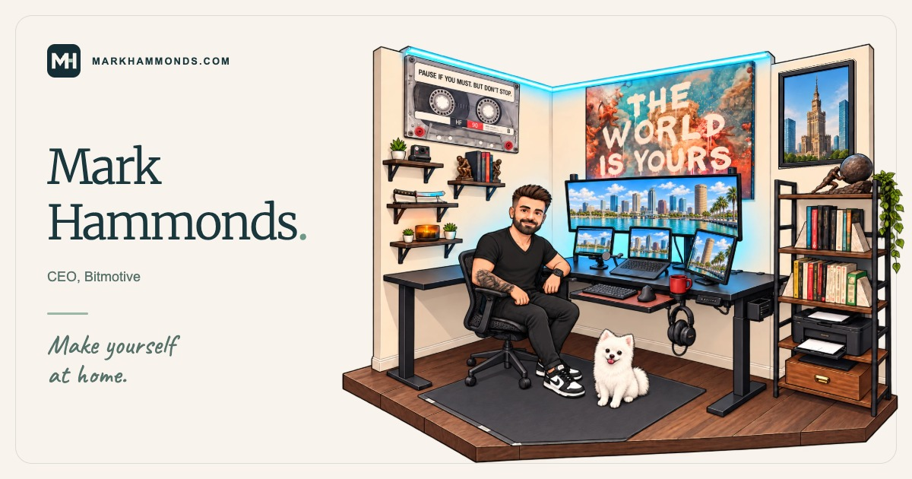

# markhammonds.com

An interactive personal website for Mark Hammonds, CEO of Bitmotive. Explore an illustrated office,
meet CiCi, discover favorite books and quotes, and play three browser games: Surf Riders, Bay Racer,
and CiCi's Treat Trail.

**[Visit the live site →](https://markhammonds.com/)**

[](https://markhammonds.com/)

Built with HTML, CSS, and JavaScript. Runtime assets are local; the 3D games share a pinned copy of
Three.js. There is no application framework or runtime npm dependency. A small build script prepares
the production asset graph and Cloudflare configuration.

## Local development

Use Node.js 24 or newer:

```sh
npm ci
npm run dev
```

Visit http://localhost:8000. Use `npm run dev -- --port 8080` for another port. The development
server assembles the homepage's critical theme fragments before returning its HTML. A generic
HTTP server can also serve the source; it loads those fragments as separate stylesheet and script
requests. The development server and production build inline them to avoid those extra requests.
Browsers also require HTTP for game ES modules and the homepage's CSS image masks.

## Working on the code

- `index.html`, `styles.css`, and `script.js` contain the main homepage. Script features use
  independent initializers so an unavailable optional feature does not prevent the others from
  starting.
- `assets/homepage/theme-bootstrap.js` and `theme-critical.css` are maintained as separate source
  files and inserted into the HTML head by the development server and production build. They
  select the theme before first paint without waiting for a separate theme request. Keep the
  palette in `theme-critical.css` as the single source of colors: the full stylesheet consumes
  those tokens, and the bootstrap reads the active background token for the browser theme color.
- `assets/shared/` holds shared arcade styles, input, audio, numeric storage, DOM updates, loading,
  camera positioning, and rendering-loop lifecycle. Games provide their own controls and events.
- `assets/surf-rides/ride-session.js`, `assets/bay-racer/race.js`, and
  `assets/cici-treat-trail/adventure.js` contain gameplay state and rules without DOM or drawing
  dependencies. Each `game.js` connects its simulation to UI, art, audio, and controls.
- `assets/vendor/three/` contains the local Three.js distribution and license. Keep its module and
  core files on the same version when intentionally upgrading.
- The earlier desk prototype has been removed. The public `/desk.html` route still redirects to `/`.

The theme follows `America/New_York`, including daylight saving time: night begins at 7 p.m. and
day begins at 6 a.m. A manual choice lasts until the next scheduled boundary. Theme checks refresh
on the minute and when the page is focused or restored. First-paint tests exercise delayed assets,
blocked storage, and saved or expired preferences.

## Checks and generated previews

```sh
npm run check                     # formatting, lint, unit and build-policy tests
npm run test:browser              # starts a source-site server and runs browser suites
npm run test:browser:production   # builds dist and checks the packaged site
npm run format                   # apply repository formatting
npm run render:previews           # regenerate the three game thumbnails
npm run render:branding           # regenerate favicons and social sharing cards
```

Browser checks use Puppeteer. If Chromium was not downloaded during installation, run
`npm run setup:browser`, or set `CHROME_BIN` to an existing Chrome executable.
GitHub Actions runs the locked install, pinned Chrome setup, static/unit checks, and the source, production and Caddy browser suites on pushes and pull requests. Pushes to
`main` then deploy (see [Hosting and deployment](#hosting-and-deployment)).
The shared browser launcher explicitly starts with desktop pointer and hover capabilities so
headless Linux and macOS simulate the same input device. Puppeteer's touch emulation still
overrides that baseline for phones and tablets; disabling it restores the desktop settings.
`tests/browser-emulation-smoke.cjs` checks these transitions and hybrid touchscreen laptops.
This device setup is independent of the graphics backend.
The Linux workflow sets `BROWSER_SOFTWARE_RENDERING=1` to exercise real WebGL through Chromium's
SwiftShader backend without a graphics device. Local runs use the default graphics backend unless
explicitly opted in. Game tests wait for initialization and rendered frames rather than network
idle, which can stall during continuous software rendering. Failed game loads save browser errors
and pending request URLs beside the screenshot artifacts in `test-results/`.
For example, on macOS:

```sh
CHROME_BIN='/Applications/Google Chrome.app/Contents/MacOS/Google Chrome' npm run test:browser
```

The browser runner discovers smoke, responsive, theme-load, and lifecycle suites. It accepts suite
filenames to run a focused subset and `--root dist` to serve an existing production build. Every
run gets its own artifact directory under ignored `test-results/`; `TEST_ARTIFACT_DIR` can change
that parent directory. Individual suites accept `SITE_URL` or `GAME_URL` for an existing server.
`PUPPETEER_MODULE` remains an optional dependency override.

Coverage includes dialogs and focus return, shuffled quotes and photos, book browsing, theme
first paint, touch controls, saved scores, gameplay, and page hide/restore. Responsive suites
include 320×568 phones, 568×320 landscape screens, portrait/landscape tablets, and laptops starting
at 1024×600. These are Chromium viewport simulations; physical-device and Safari checks remain
separate. Game debug hooks are available only with `?debug=1`.

Preview generators live under `tools/render-*-preview.cjs` and use the actual game art/models.
They start a local source server automatically. Use `--output` or `PREVIEW_OUTPUT` to save a review
copy elsewhere, and `--site-url` or `SITE_URL` to use an existing server. Ordinary checks never
overwrite artwork.
`assets/favicon.svg` is the favicon source; `render:branding` produces its browser/Apple raster
exports, `favicon.ico`, and four 1200×630 JPG sharing cards in `assets/social/`.

## Homepage and games

The hero is a responsive 3:2 illustrated office based on Mark's workstation, with day/night art,
his cartoon avatar, CiCi, and a Warsaw picture centered on the Palace of Culture and Science.
All four monitors use the Tampa panorama; the lower three display adjoining crops. The original
Bitmotive monitor treatment is historical. The official logo remains on the business card.

On devices without hover, small pulsing pins mark interactive scene objects except Mark, CiCi,
the candle, and the large monitor. Mark, CiCi, and the candle remain tappable without pins.
The candle has an invisible 44px circular target below its artwork, clear of the katana target.
The large monitor is decorative on touch devices and links to projects only on devices with hover.
Each pin is part of its existing button or link, with a 44px circular touch target. On compact scenes, crowded pins
spread apart with short connecting lines to their objects so neighboring targets do not overlap.
The dot gently grows and shrinks while a contrasting ring expands and fades every two seconds.
Pins stay still when reduced motion is enabled; desktop hover labels and keyboard focus behavior
remain available.

On touch devices, only the office illustration suppresses double-tap/pinch zoom, selection,
image dragging, and the iOS touch callout so missed taps and scrolling cannot select or pick up
the artwork. Vertical scrolling remains available. The rest of the page and its dialogs retain
native zoom and text selection, including copying quotes and the business card email address.
Book covers support pinch zoom alongside horizontal carousel swipes.

- The ultrawide opens the project section. The left screen links to Twitter, the laptop to
  LinkedIn, and the right screen to GitHub. On phones and desktop, activating an external screen
  link first opens a confirmation with its destination and “Stay here” / “Open” choices. Confirming
  opens an isolated new tab while keeping the homepage open. The submenu contains direct links
  to those same profiles. `tests/external-links-smoke.cjs` checks confirmation and cancellation.
- Mark's name and portrait open a business card with his “CEO, Bitmotive” title, official logo,
  and links to the company website and `mark@bitmotive.com`.
- The candle toggles, CiCi responds to pets, and the Warsaw painting opens to reveal the safe.
- The camera opens one of six local photos in a dynamically framed Polaroid. “Another photo”
  exhausts a shuffled collection before repeating and avoids an immediate repeat between batches.
- The small left bookshelf opens _Meditations_; the katana opens _The Art of War_. Each reading
  dialog shuffles twelve verified passages and links to the source book/chapter/section. The quotes
  use the public-domain [George Long translation of Meditations](https://en.wikisource.org/wiki/The_Thoughts_of_the_Emperor_Marcus_Aurelius_Antoninus)
  and [Lionel Giles's 1910 Art of War translation](https://www.gutenberg.org/cache/epub/17405/pg17405-images.html).
  `tests/meditations-smoke.cjs` covers their shared native-dialog behavior, focus return, citations,
  and responsive layouts.
- The right bookshelf opens an eleven-title favorite-books carousel. Its catalog and local covers
  live in `assets/books/`; [cover provenance](assets/books/README.md) records the editions. Previous/
  next buttons, arrow keys, Home/End, and cover swipes navigate it. Cover links and “View on Amazon”
  open Mark's supplied product URLs. Mark chose to retain the self-hosted thumbnails so the
  carousel's images do not depend on Amazon requests at runtime. `tests/books-smoke.cjs` covers
  browsing and failure recovery.
- The Sisyphus statue opens Mark's chosen Albert Camus quote in a matching reading dialog, with
  the Justin O’Brien translation credited and a link to Penguin's 2013 Modern Classics edition of
  _The Myth of Sisyphus_.

All dialogs support Escape, the close button, backdrop dismissal, and focus restoration. Website
links open in a new tab with `noopener noreferrer`; scene controls and section jumps stay on
the current page. The email link opens the visitor's email app without requesting a new tab.
Download links retain their download behavior.

| Game               | Behavior                                                                                                                                                | Documentation                                                                                                 |
| ------------------ | ------------------------------------------------------------------------------------------------------------------------------------------------------- | ------------------------------------------------------------------------------------------------------------- |
| Surf Riders        | Drive Mark's olive Jeep around a Nosara-inspired map, collect coconuts, pick up surfers, and deliver them to Playa Guiones during a three-minute shift. | [Controls and mechanics](assets/surf-rides/README.md), [Jeep model](assets/surf-rides/MODEL.md)               |
| Bay Racer          | Race the photo-inspired Sea-Doo Wake 230 through eight ordered buoy gates over three laps; clean lines refill boost and collisions add time.            | [Controls and mechanics](assets/bay-racer/README.md), [boat model](assets/bay-racer/MODEL.md)                 |
| CiCi's Treat Trail | Collect 75 treats, dodge eight squirrels, use checkpoints, and reach the picnic doghouse in an original Canvas side-scroller.                           | [Controls and mechanics](assets/cici-treat-trail/README.md), [level design](assets/cici-treat-trail/LEVEL.md) |

Each game supports keyboard/touch controls, pause, optional audio, and locally saved best results.
Surf Riders and Bay Racer use continuous touch steering around the vehicle: finger distance controls
throttle, pointing behind selects reverse, and lifting lets it coast. Both have a separate Brake
button; Bay Racer also has Boost. Keyboard controls use Up/Down for forward/reverse and Left/Right
for steering, including simultaneous presses. Scene touch handling and pedal mapping live in
`assets/shared/touch-drive.js` and `assets/shared/vehicle-drive.js`; each simulation retains its own
handling and speed limits. Both compact layouts keep essential stats and the destination visible,
show the map by default with a toggle to hide it, and put recovery in the pause menu. Shared driving
layout and menu state live in `assets/shared/driving.css` and `assets/shared/driving-ui.js`; CiCi
keeps her platformer UI.
The old `/cr-surf-rides.html` path redirects to `/surf-riders.html`; Asteroids is not shipped.

## Artwork and private references

The current workstation files are the WebP scene variants, v4 avatar crops, single daytime tattoo
crop, Tampa screen crop, and SVG safe overlays in `assets/workstation/`. Both themes use the same
tattoo drawing and position; a CSS filter changes its nighttime lighting. The original
`office-day.webp` and `office-day-small.webp` remain necessary alpha masks.

Generation prompts and placement details remain in the workstation Markdown files. Historical
references to Bitmotive screens or superseded clothing inside exact prompts describe the image
being edited at that time. [TAMPA-BAY.md](assets/workstation/TAMPA-BAY.md) and
[CARTOON-REVISION.md](assets/workstation/CARTOON-REVISION.md) describe the current treatments.

Unused full-size source renders and earlier scene/character exports were moved to the external
[art archive](docs/art-archive.md). Its manifest records paths, sizes, and SHA-256 hashes after
byte-for-byte verification. Runtime files and render-tool inputs remain here. This reduces the
current checkout's artwork by 31.46 MiB. Mark subsequently restarted the Git history before the
public import, so this repository does not retain the archived blobs. Mark also confirmed an
off-machine backup of the archive; its location and contents have not been independently verified.

Personal reference photographs remain in the owner's private `Mark Hammonds Photos` collection,
including its `Jeep`, `Boat`, `Tattoos`, and `Polaroids` subfolders. They are not build dependencies.
The six public Polaroid JPGs are optimized exports with baked-in orientation, an sRGB color space,
a maximum 1600px long edge, and no EXIF/GPS metadata. To add a photo, add its web export and a
matching descriptive entry in the homepage photo list. Fonts are self-hosted in `assets/fonts/`
with their SIL Open Font Licenses.

[maintenance-audit.md](docs/maintenance-audit.md) preserves the September 28, 2026 review and its
verification results as a historical record. This README describes the maintained architecture
and workflows; the build and test runners report current totals.

## Hosting and deployment

The site is served by [Caddy](https://caddyserver.com/) on an American Cloud VM
(`aronwagner-web`, Ubuntu 26.04, us-central-0). Cloudflare provides DNS and the CDN in front of
it: both `aronwagner.com` and `www` are proxied records, SSL/TLS mode is **Full (strict)**, and the
VM presents a Cloudflare Origin Certificate. The VM firewall only accepts HTTPS from
[Cloudflare's IP ranges](https://www.cloudflare.com/ips/), so the origin cannot be reached directly.

Pushes to `main` deploy automatically after every check passes: the `deploy` job in
`.github/workflows/check.yml` builds `dist/`, publishes it with `deploy/deploy.sh`, and runs
`deploy/smoke.sh` against the live site. It uses the `production` environment's secrets:

| Secret               | Value                                                                |
| -------------------- | -------------------------------------------------------------------- |
| `DEPLOY_HOST`        | The VM's public IP address                                           |
| `DEPLOY_SSH_KEY`     | Private key for the VM's `deploy` user                               |
| `DEPLOY_KNOWN_HOSTS` | The VM's SSH host key line (`ssh-keyscan -t ed25519 <ip>`, verified) |

To deploy manually, build and publish with the deploy key:

```sh
DEPLOY_HOST=<vm-ip> DEPLOY_SSH_KEY_FILE=~/.ssh/aronwagner_deploy_ed25519 npm run deploy
```

Each deploy uploads a timestamped release to `/srv/aronwagner.com/releases/`, switches the
`current` link to it, and reloads Caddy. If Caddy rejects the release's rules, the previous release
is restored. The five newest releases are kept. Fingerprinted files go to a shared
`/srv/aronwagner.com/immutable/` directory that deploys never prune, so pages that are already
open keep loading their assets after a release.

`deploy/Caddyfile` is the server configuration and `deploy/provision.sh` prepares a fresh VM. It
installs Caddy, creates the `deploy` user (which may only reload Caddy), disables SSH passwords,
configures the firewall, and installs the Caddyfile. Re-run it to refresh Cloudflare's IP ranges:

```sh
scp deploy/Caddyfile cloud@<vm-ip>:/tmp/Caddyfile
ssh cloud@<vm-ip> sudo bash -s -- "'$(cat ~/.ssh/aronwagner_deploy_ed25519.pub)'" < deploy/provision.sh
```

Install the origin certificate and key as `/etc/caddy/certs/aronwagner.com.pem` and `.key` (group
`caddy`, mode 640), then run `sudo systemctl reload caddy`. Until then, provisioning leaves a
self-signed stand-in, which Full (strict) rejects.

### Build output and response policies

`npm run build:site` selects runtime files, assembles the theme fragments, and prepares ignored
`dist/`; source notes, historical art, tests, development tools, and documentation are excluded.
Build output reports the current file count and size; `dist/asset-manifest.json` maps source asset
paths to their production URLs. Keep the workstation allowlist in `tools/lib/site-build.js`
synchronized with artwork changes.

Production assets use content-derived URLs under `/immutable/` with a one-year immutable cache
policy. The build rewrites references consistently, so routine asset changes do not require
hand-edited query version tokens. Small application scripts/styles share a version derived from
their graph and referenced assets; large images, fonts, and the vendored library retain
independent versions across unrelated code changes. Stable asset aliases use temporary redirects
to their current immutable versions.

The build hashes inline scripts for its Content Security Policy instead of allowing arbitrary
inline JavaScript. The policy permits local assets and Cloudflare Web Analytics, prevents framing,
and disables object embeds and form submissions. Inline styles remain allowed for the illustrated
scene and dynamic game UI. Referrer, MIME-sniffing, and browser-permission headers are also emitted.

The build writes these headers and redirects from one rule list in two forms: `dist/site.caddy`,
which the VM's Caddyfile imports for each release, and `dist/_headers`/`dist/_redirects`, which the
local server in `tools/serve.js` uses for `npm run test:browser:production`. A unit test checks the
two agree. CI also serves the build through `deploy/Caddyfile` itself and runs `deploy/smoke.sh`
and every browser suite against it (`node tools/test-browser.js --url <site>` targets any running
server). Test the packaged site when changing loading behavior, headers, asset references, or
redirects.
